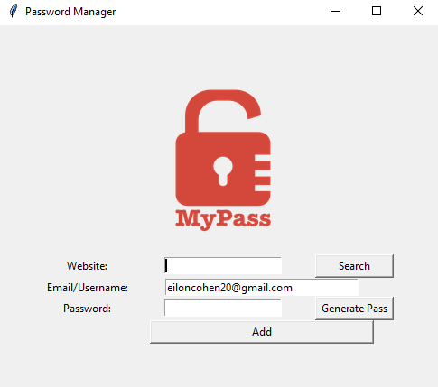
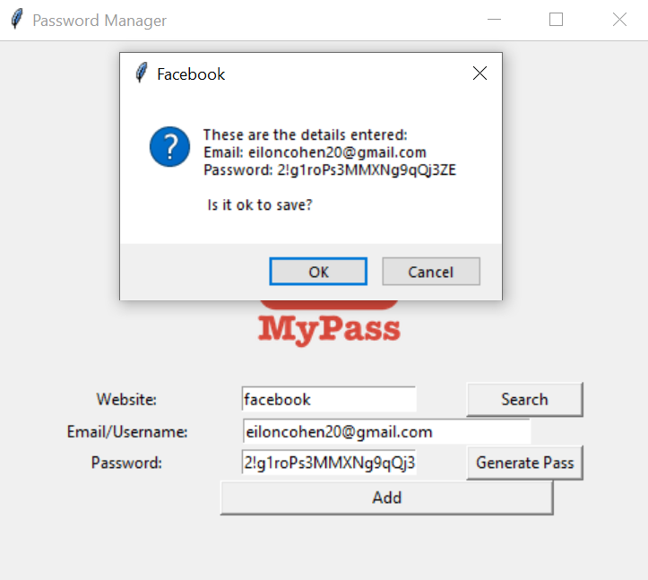
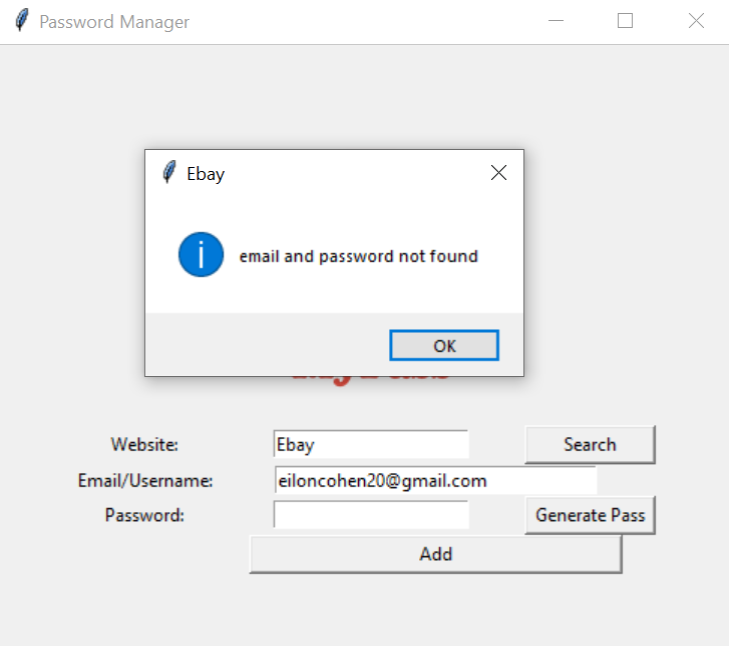
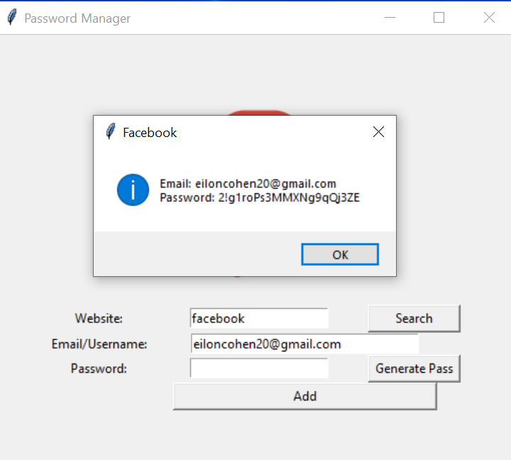

# Password-Manager
building a Password manager and manage our password more easily

# images 

First screen of the system, wuth my email and two input empty fields of website name and password.
the password contains numbers of characters and letters randomly 21 characters long and generated Randomly.

After we enterd website name and generated password by button click, this window show up after click on Add button.
if we will click on ok button, all data will save in json file.
if we will click on cancel button, we will return to homepage screen.

enterd a website name that no exist in json file and click on search button, and return this popup message.

enterd a website name that no exist in json file and click on search button, and return this popup message with username and password for this specific website.

